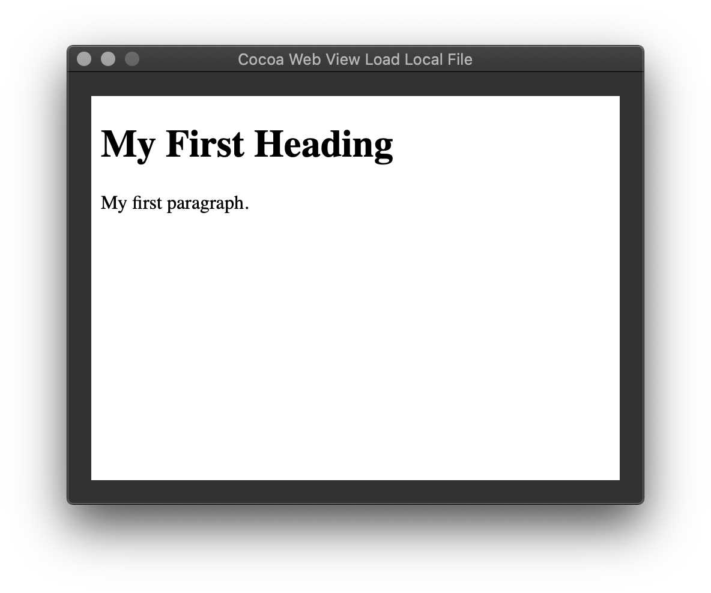

# Cocoa Web View Load Local File

This repository contains implementation of loading local .html file in WKWebView.

[Cocoa macOS Examples](https://github.com/NikolaGrujic91/Cocoa-macOS-Examples)

In order to use web view it is neccessary to enable Outgoing connections (Client) in Signing & Capabilities tab of project settings

In order to load local file it is neccessary to add file as a resource to project.In Build Phases settings of project, file needs to show up under Copy Bundle Resources.

